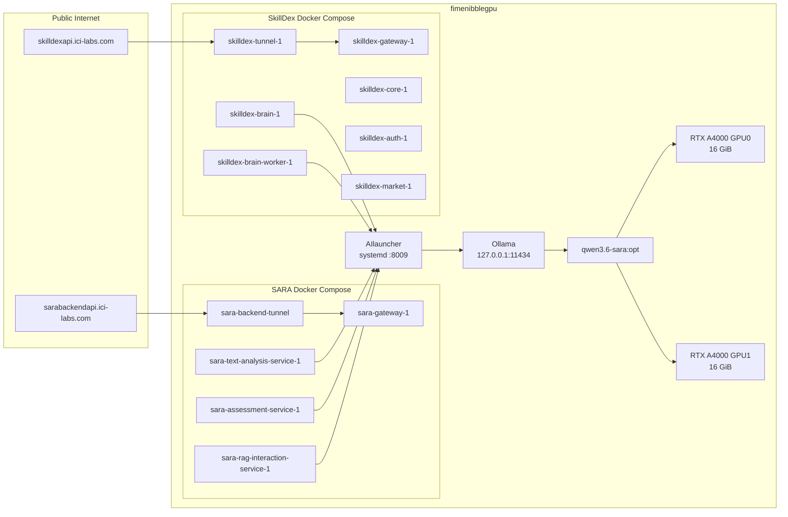

# SkillDex + SARA Shared Inference Demo Runbook

Date of stabilization: 2026-05-12 America/Mexico_City

Last verified snapshot: 2026-05-13T01:59:29Z

This document is intentionally verbose. It is meant to be the handoff note for
returning to this project later without having to reconstruct the deployment
history from terminal scrollback.

## TL;DR

For the demo, keep the system exactly as it is now.

The stable production/demo path is:

```text
SkillDex containers
        |
        | http://host.docker.internal:8009/v1
        v
AIlauncher systemd service
        |
        | Ollama backend, local only
        v
Ollama on 127.0.0.1:11434
        |
        | qwen3.6-sara:opt
        v
2 x NVIDIA RTX A4000
```

SARA uses the same shared inference gateway:

```text
SARA containers
        |
        | http://host.docker.internal:8009/v1
        v
AIlauncher -> Ollama -> qwen3.6-sara:opt
```

Public APIs are exposed through separate Cloudflare tunnels:

- SkillDex API: `https://skilldexapi.ici-labs.com`
- SARA API: `https://sarabackendapi.ici-labs.com`

Current state:

- SkillDex public health: OK
- SARA public health: OK
- SkillDex can call AIlauncher: OK
- SARA can call AIlauncher: OK
- Ollama detects both GPUs: OK
- Current stable throughput through the shared gateway: about 36 completion tokens/s
- Previous experimental fast path: about 60-76 completion tokens/s, but not currently active

Decision:

- Do not chase the 60 tok/s path for the demo.
- Keep `sara-main` stable on the Ollama backend.
- Revisit `sara-fast` or a proper llama.cpp/no-think route after the demo.

## Server Identity

The deployment target is the GPU server:

```text
hostname: fimenibblegpu
OS: Ubuntu 24.04.4 LTS
kernel: 6.8.0-111-generic
CPU: 24 vCPU
RAM: about 19 GiB
GPU: 2 x NVIDIA RTX A4000, 16376 MiB each
NVIDIA driver: 595.58.03
```

Do not commit SSH passwords, Cloudflare tunnel tokens, or AIlauncher API keys.
Secrets are intentionally omitted from this document.

Important remote paths:

```text
/opt/ailauncher/app
/opt/ailauncher/venv
/opt/ailauncher/app/deploy/models.server.json
/etc/ailauncher/ailauncher.env
/etc/systemd/system/ailauncher.service
/etc/systemd/system/ollama.service
/etc/systemd/system/ollama.service.d/override.conf
/etc/systemd/system/ollama.service.d/20-memory-guards.conf
/opt/skilldex_back
/srv/ai-data/ollama/models
/srv/ai-data/ailauncher/experiments
```

Local project paths:

```text
C:\Users\pedro\work\lmLauncherpaper
C:\Users\pedro\work\lmLauncherpaper\AIlauncher
C:\Users\pedro\work\skilldex_back
```

## Current Architecture



The key design choice is that SkillDex and SARA do not each load their own
model. They both use AIlauncher as the shared OpenAI-compatible inference
gateway.

## Active AIlauncher Configuration

AIlauncher is running as a systemd service:

```text
Service: ailauncher.service
WorkingDirectory: /opt/ailauncher/app
Command:
/opt/ailauncher/venv/bin/lmserv serve \
  --catalog /opt/ailauncher/app/deploy/models.server.json \
  --host 0.0.0.0 \
  --port 8009 \
  --ollama-base-url http://127.0.0.1:11434
```

AIlauncher listens on:

```text
http://0.0.0.0:8009
```

Client-facing OpenAI-compatible base URL:

```text
http://host.docker.internal:8009/v1
```

This works from Docker containers because the SkillDex compose file maps:

```yaml
extra_hosts:
  - host.docker.internal:host-gateway
```

SARA containers also use `host.docker.internal`.

### Active Catalog

Remote catalog path:

```text
/opt/ailauncher/app/deploy/models.server.json
```

Current deployed route:

```json
{
  "default_model": "sara-main",
  "models": [
    {
      "name": "sara-main",
      "backend": "ollama",
      "target": "qwen3.6-sara:opt",
      "priority": 100,
      "aliases": [
        "default",
        "qwen-main",
        "research-main",
        "sara-structured",
        "research-structured"
      ],
      "base_url": "http://127.0.0.1:11434",
      "settings": {
        "think": false,
        "keep_alive": "5m",
        "options": {
          "num_ctx": 4096,
          "num_gpu": 41,
          "num_batch": 512,
          "num_thread": 24
        }
      },
      "capabilities": {
        "structured_output": true,
        "json_mode": true,
        "tools": true,
        "streaming": true
      }
    }
  ]
}
```

Important note:

- The current route is `backend: "ollama"`.
- It is not the earlier llama.cpp/no-think fast path.
- The current route is the stable demo route.

## Active Ollama Configuration

Ollama is running locally only:

```text
OLLAMA_HOST=127.0.0.1:11434
OLLAMA_MODELS=/srv/ai-data/ollama/models
OLLAMA_SCHED_SPREAD=true
OLLAMA_FLASH_ATTENTION=true
OLLAMA_MAX_LOADED_MODELS=1
OLLAMA_NUM_PARALLEL=1
OLLAMA_KEEP_ALIVE=5m
```

Systemd guardrails:

```text
MemoryAccounting=yes
MemoryHigh=12G
MemoryMax=18G
OOMPolicy=stop
```

These guardrails were added because CPU fallback with this model can consume
almost all host RAM. The goal is to protect the host during a demo, even if it
means Ollama is stopped rather than letting the whole server become unstable.

Installed models:

```text
qwen3.6-sara:opt
qwen3.6:35b
qwen3:30b
```

Expected healthy GPU state after a warm request:

```text
ollama ps

qwen3.6-sara:opt    27 GB    100% GPU    4096    <minutes remaining>
```

Expected cold state after 5 minutes idle:

```text
ollama ps

NAME    ID    SIZE    PROCESSOR    CONTEXT    UNTIL
```

The empty `ollama ps` output is not a failure. It means the model unloaded
after `keep_alive=5m`.

## SkillDex Integration

Remote project:

```text
/opt/skilldex_back
```

Public endpoint:

```text
https://skilldexapi.ici-labs.com
```

Internal gateway mapping:

```text
127.0.0.1:8010 -> skilldex-gateway-1:8000
```

SkillDex services confirmed running:

```text
skilldex-tunnel-1
skilldex-gateway-1
skilldex-brain-worker-1
skilldex-brain-1
skilldex-core-1
skilldex-market-1
skilldex-auth-1
skilldex-postgres-1
skilldex-redis-1
skilldex-minio-1
```

SkillDex brain uses AIlauncher through:

```text
AILAUNCHER_BASE_URL=http://host.docker.internal:8009
AILAUNCHER_MODEL=sara-main
AILAUNCHER_API_KEY=<from remote env, not committed>
```

Code path:

```text
C:\Users\pedro\work\skilldex_back\skilldex_brain\skilldex_brain\services\llm.py
```

The important behavior in that file:

- If `AILAUNCHER_BASE_URL` is set, SkillDex uses AIlauncher.
- Otherwise it falls back to direct Ollama.
- In deployment, `AILAUNCHER_BASE_URL` is set, so it uses AIlauncher.

Docker memory limits currently applied:

| Container | Limit |
|---|---:|
| `skilldex-postgres-1` | 1 GiB |
| `skilldex-redis-1` | 256 MiB |
| `skilldex-minio-1` | 512 MiB |
| `skilldex-auth-1` | 512 MiB |
| `skilldex-core-1` | 768 MiB |
| `skilldex-brain-1` | 2 GiB |
| `skilldex-brain-worker-1` | 4 GiB |
| `skilldex-market-1` | 512 MiB |
| `skilldex-gateway-1` | 512 MiB |
| `skilldex-tunnel-1` | 128 MiB |

## SARA Integration

Public endpoint:

```text
https://sarabackendapi.ici-labs.com
```

SARA services confirmed running:

```text
sara-backend-tunnel
sara-gateway-1
sara-rag-interaction-service-1
sara-assessment-service-1
sara-text-analysis-service-1
sara-document-service-1
sara-academic-service-1
sara-auth-service-1
sara-postgres-1
sara-redis-1
```

SARA frontend services also running:

```text
sara_frontend_tunnel
sara_frontend_web
```

Relevant SARA LLM env values, redacted:

```text
DOCKER_LLM_URL=http://host.docker.internal:8009/v1
AS_LLM_SERVICE_URL=http://host.docker.internal:8009/v1
DEFAULT_LLM_MODEL=sara-main
TAS_DEFAULT_LLM_MODEL=sara-main
AS_DEFAULT_LLM_MODEL=sara-main
TAS_LLM_API_KEY=<redacted>
AS_LLM_API_KEY=<redacted>
```

The important part is that SARA also talks to the same AIlauncher gateway, not
directly to Ollama.

## Public Endpoint Validation

Last verified snapshot:

| Endpoint | Result |
|---|---|
| `https://skilldexapi.ici-labs.com/health-matrix` | HTTP 200 |
| `https://skilldexapi.ici-labs.com/api/v1/market/plans` | HTTP 200 |
| `https://skilldexapi.ici-labs.com/api/v1/auth/users` | HTTP 200 |
| `https://skilldexapi.ici-labs.com/openapi.json` | HTTP 200 |
| `https://sarabackendapi.ici-labs.com/` | HTTP 200 |

SkillDex public health response had all services UP:

```text
brain_service=UP
core_service=UP
market_service=UP
auth_service=UP
```

SARA public response:

```json
{
  "status": "SARA API Gateway is running",
  "services": ["auth", "academic", "documents", "analysis", "assessment", "rag"]
}
```

## Inference Validation

Two direct application-container tests were run.

SkillDex:

```text
source: skilldex-brain-1
prompt: Responde exactamente: OK
result: OK
elapsed: 1.27 s
```

SARA:

```text
source: sara-text-analysis-service-1
prompt: Responde exactamente: OK
result: OK
elapsed: 1.20 s
model: sara-main
```

Both tests confirmed that application containers can reach AIlauncher and get a
valid model response.

## Stable Demo Benchmark

Benchmark timestamp:

```text
2026-05-12T20:10:37Z
```

Machine-readable local artifact:

```text
docs/operations/2026-05-12-skilldex-sara-benchmark.json
```

The benchmark was run from inside each application container, which means the
numbers include container-to-host routing and AIlauncher gateway overhead.

Prompt:

```text
Redacta un resumen tecnico en espanol de exactamente 180 palabras sobre un
gateway de inferencia compartido. No uses listas. Incluye AIlauncher, GPU,
tuneles Cloudflare, aislamiento por servicios, metricas de latencia y control
de memoria.
```

Settings:

```text
model=sara-main
temperature=0
max_tokens=260
stream=false
```

Measured results:

| Source container | Avg elapsed | Avg completion tokens | Avg completion tok/s | Min tok/s | Max tok/s |
|---|---:|---:|---:|---:|---:|
| `skilldex-brain-1` | 7.243 s | 260 | 35.914 tok/s | 34.759 | 36.530 |
| `sara-text-analysis-service-1` | 7.131 s | 260 | 36.491 tok/s | 35.389 | 37.908 |

Warmup observation:

| Source container | Warmup elapsed | Warmup completion tokens | Notes |
|---|---:|---:|---|
| `skilldex-brain-1` | 56.185 s | 32 | Included cold model load into VRAM |
| `sara-text-analysis-service-1` | 1.764 s | 32 | Model was already warm after SkillDex request |

GPU state after benchmark:

| GPU | Model | VRAM used | VRAM total |
|---:|---|---:|---:|
| 0 | NVIDIA RTX A4000 | 13221 MiB | 16376 MiB |
| 1 | NVIDIA RTX A4000 | 12731 MiB | 16376 MiB |

Interpretation:

- Cold load can take around 50-60 seconds.
- Warm inference is around 36 tok/s end-to-end through the stable shared route.
- This is good enough for a demo if the first user request is warmed ahead of
  time.
- Because `keep_alive=5m`, warm the model within 5 minutes of the demo.

## Previous Fast Path Benchmark

There was a previous faster experiment, and the user's memory of around 60
tok/s is correct. It is just not the active production route today.

Remote experiment directory:

```text
/srv/ai-data/ailauncher/experiments/qwen36-runtime-port-20260504T062152Z
```

Relevant file:

```text
llamacpp-compatible-nothink-benchmark.jsonl
```

Historical results:

| Case | Completion tokens | Wall time | Wall tok/s | Path |
|---|---:|---:|---:|---|
| `controlled_256` | 256 | 4.140 s | 61.84 tok/s | `llamacpp-compatible-nothink` |
| `assessment_like` | 768 | about 10.076 s | 76.22 tok/s | `llamacpp-compatible-nothink` |
| `concurrent_2` | 256 | about 3.973 s | 64.44 tok/s | `llamacpp-compatible-nothink` |
| `concurrent_1` | 256 | about 6.760 s | 37.87 tok/s | `llamacpp-compatible-nothink` |

What this means:

- The faster path existed.
- It appears to have used a leaner no-think / llama.cpp-compatible style.
- It is not currently wired as the default `sara-main` route.
- The current default is intentionally stable, not maximally optimized.

Do not change this before the demo unless there is time to benchmark and
rollback safely.

Recommended future plan:

1. Keep `sara-main` as the stable production route.
2. Add a second route, for example `sara-fast`.
3. Recreate the no-think / llama.cpp-compatible benchmark under controlled
   conditions.
4. Compare `sara-main` and `sara-fast` from both SkillDex and SARA containers.
5. Only promote `sara-fast` after health, JSON mode, structured output, and
   multi-service calls pass.

## Incident: What Broke And Why

The outage was not fundamentally an AIlauncher design failure. It was a host
runtime failure caused by GPU driver drift after a kernel update.

Symptoms observed:

- SSH TCP accepted connections but sometimes did not return a usable banner.
- Cloudflare tunnels returned errors.
- SkillDex/SARA public endpoints became unreliable.
- Host memory pressure was severe.
- Swap was full or nearly full.
- Ollama runner was using most of system RAM.

Key evidence:

```text
nvidia-smi failed
modprobe nvidia failed
running kernel: 6.8.0-111-generic
installed NVIDIA module: 6.8.0-110-generic
```

Ollama evidence before the fix:

```text
inference compute id=cpu
total_vram="0 B"
offloaded 0/41 layers to GPU
qwen3.6-sara:opt PROCESSOR 100% CPU
model weights on CPU: about 22.3 GiB
total model memory: about 24.3 GiB
ollama runner RSS: about 18 GiB
```

Why the server still ran out of memory even though it has "32 GB VRAM":

- The server has 2 x 16 GB RTX A4000, not one single 32 GB GPU.
- More importantly, the NVIDIA driver was not loaded.
- Because the driver was unavailable, Ollama could not use VRAM.
- Ollama fell back to CPU.
- The model then lived mostly in host RAM.
- The AIlauncher route had `keep_alive=24h`, so the model stayed resident.
- Host RAM is only about 19 GiB.
- Swap was not enough to save interactive responsiveness.

This is why the system entered a bad state.

## Fixes Applied

### GPU Driver Fix

Installed the available NVIDIA server-open branch for the active kernel:

```text
nvidia-headless-no-dkms-595-server-open
nvidia-utils-595-server
linux-modules-nvidia-595-server-open-generic
linux-modules-nvidia-595-server-open-6.8.0-111-generic
```

Verified after install:

```text
nvidia-smi works
driver version: 595.58.03
2 x NVIDIA RTX A4000 visible
```

### AIlauncher/Ollama Runtime Fix

Changed the AIlauncher catalog:

```text
keep_alive: 24h -> 5m
```

Unloaded the CPU-resident model:

```bash
curl http://127.0.0.1:11434/api/generate \
  -H 'Content-Type: application/json' \
  -d '{"model":"qwen3.6-sara:opt","keep_alive":0,"prompt":""}'
```

Restarted Ollama and AIlauncher after the NVIDIA driver was healthy.

Verified:

```text
Ollama detected CUDA0 and CUDA1
offloaded 41/41 layers to GPU
model weights split across both GPUs
ollama ps showed PROCESSOR 100% GPU
```

### Memory Guardrails

Added 16 GiB extra swap:

```text
/swap.img: 8 GiB
/swapfile-skilldex: 16 GiB
total swap: about 23 GiB
```

Set sysctl memory tuning:

```text
vm.swappiness=10
vm.vfs_cache_pressure=50
```

Added Ollama memory guardrails:

```text
MemoryHigh=12G
MemoryMax=18G
OLLAMA_MAX_LOADED_MODELS=1
OLLAMA_NUM_PARALLEL=1
OLLAMA_KEEP_ALIVE=5m
```

Added SkillDex Docker memory limits, listed above.

## Demo Checklist

Run this before a demo.

### 1. Verify GPU

```bash
nvidia-smi
```

Expected:

```text
2 x NVIDIA RTX A4000
Driver Version: 595.58.03 or compatible
No driver communication error
```

### 2. Verify AIlauncher And Ollama

```bash
systemctl is-active ailauncher
systemctl is-active ollama
curl -fsS http://127.0.0.1:8009/health
```

Expected:

```text
active
active
{"status":"ok", ... "sara-main": {"backend":"ollama","target":"qwen3.6-sara:opt"}}
```

### 3. Warm The Model

Use the real API key from `/etc/ailauncher/ailauncher.env`, but do not print it
or commit it.

Example server-side warmup:

```bash
python3 - <<'PY'
import json, pathlib, urllib.request

api_key = None
for line in pathlib.Path("/etc/ailauncher/ailauncher.env").read_text().splitlines():
    if "=" in line and line.split("=", 1)[0].strip() == "API_KEY":
        api_key = line.split("=", 1)[1].strip().strip('"').strip("'")

payload = {
    "model": "sara-main",
    "messages": [{"role": "user", "content": "Responde exactamente: OK"}],
    "max_tokens": 8,
    "temperature": 0
}

req = urllib.request.Request(
    "http://127.0.0.1:8009/v1/chat/completions",
    data=json.dumps(payload).encode(),
    headers={
        "Content-Type": "application/json",
        "Authorization": "Bearer " + api_key
    },
    method="POST",
)

with urllib.request.urlopen(req, timeout=420) as resp:
    print(resp.read().decode())
PY
```

Then check:

```bash
ollama ps
```

Expected:

```text
qwen3.6-sara:opt    27 GB    100% GPU    4096
```

### 4. Verify Public APIs

```bash
curl -fsS https://skilldexapi.ici-labs.com/health-matrix
curl -fsS https://skilldexapi.ici-labs.com/api/v1/market/plans
curl -fsS https://skilldexapi.ici-labs.com/api/v1/auth/users
curl -fsS https://sarabackendapi.ici-labs.com/
```

Expected:

- all commands return HTTP 200
- SkillDex health matrix reports all services UP
- SARA gateway reports its service list

### 5. Verify Container-To-AIlauncher Calls

SkillDex:

```bash
docker exec -i skilldex-brain-1 python - <<'PY'
import asyncio, json, time
from skilldex_brain.services import llm

async def main():
    start = time.time()
    text = await llm._chat_completion("Responde exactamente: OK")
    print(json.dumps({"elapsed_s": round(time.time() - start, 2), "content": text}, ensure_ascii=False))

asyncio.run(main())
PY
```

SARA:

```bash
docker exec -i sara-text-analysis-service-1 python - <<'PY'
import json, os, time, urllib.request

base = os.environ.get("DOCKER_LLM_URL") or os.environ.get("AS_LLM_SERVICE_URL")
key = os.environ.get("TAS_LLM_API_KEY") or os.environ.get("AS_LLM_API_KEY")
model = os.environ.get("TAS_DEFAULT_LLM_MODEL") or os.environ.get("DEFAULT_LLM_MODEL") or "sara-main"
url = base.rstrip("/") + "/chat/completions"

payload = {
    "model": model,
    "messages": [{"role": "user", "content": "Responde exactamente: OK"}],
    "max_tokens": 8,
    "temperature": 0
}

req = urllib.request.Request(
    url,
    data=json.dumps(payload).encode(),
    headers={"Content-Type": "application/json", "Authorization": "Bearer " + key},
    method="POST",
)

start = time.time()
with urllib.request.urlopen(req, timeout=120) as resp:
    obj = json.loads(resp.read().decode())

print(json.dumps({
    "elapsed_s": round(time.time() - start, 2),
    "model": model,
    "content": obj.get("choices", [{}])[0].get("message", {}).get("content"),
    "usage": obj.get("usage")
}, ensure_ascii=False))
PY
```

Expected:

```text
content=OK
```

## Benchmark Command Template

Use this only when you actually need paper numbers. It intentionally measures
from inside app containers.

```bash
# Keep this server-side; it reads the API key from service env/files.
# Do not paste the key into docs or terminal output.
```

The last benchmark used:

- 3 measured requests per service
- 260 max completion tokens
- temperature 0
- non-streaming
- completion tokens divided by wall-clock seconds

Current numbers to cite for the demo:

```text
SkillDex -> AIlauncher -> Ollama: 35.914 tok/s avg
SARA     -> AIlauncher -> Ollama: 36.491 tok/s avg
```

Historical fast-path numbers to cite separately:

```text
llamacpp-compatible-nothink controlled_256: 61.84 tok/s
llamacpp-compatible-nothink assessment_like: 76.22 tok/s
```

Do not mix these two benchmark families in the paper without labeling them:

- "stable deployed shared gateway"
- "experimental optimized runtime"

## Troubleshooting

### If public SkillDex fails

Check:

```bash
docker ps | grep skilldex
cd /opt/skilldex_back
docker compose ps
docker compose logs --tail=120 gateway
docker compose logs --tail=120 tunnel
curl -sS http://127.0.0.1:8010/health-matrix
```

If local gateway works but public URL fails, suspect Cloudflare tunnel.

If local gateway fails, inspect service logs:

```bash
docker compose logs --tail=120 auth core brain market gateway
```

### If SARA fails

Check:

```bash
docker ps | grep sara
curl -sS https://sarabackendapi.ici-labs.com/
docker logs --tail=120 sara-gateway-1
docker logs --tail=120 sara-backend-tunnel
```

### If inference is slow

First check GPU state:

```bash
nvidia-smi
ollama ps
journalctl -u ollama --since "10 minutes ago" --no-pager | grep -Ei "cuda|vram|gpu|inference compute|offloaded|CPU"
```

Healthy:

```text
inference compute ... library=CUDA
offloaded 41/41 layers to GPU
ollama ps: PROCESSOR 100% GPU
```

Bad:

```text
nvidia-smi failed
inference compute id=cpu
total_vram="0 B"
offloaded 0/41 layers to GPU
ollama ps: PROCESSOR 100% CPU
```

If the bad state appears, do not keep benchmarking. Fix the driver/runtime
first, or unload the model to protect RAM:

```bash
curl http://127.0.0.1:11434/api/generate \
  -H 'Content-Type: application/json' \
  -d '{"model":"qwen3.6-sara:opt","keep_alive":0,"prompt":""}'
```

### If `nvidia-smi` breaks after a future reboot

Likely cause:

- kernel updated
- matching NVIDIA kernel module missing

Check:

```bash
uname -r
dpkg -l | grep -Ei 'linux-modules-nvidia|nvidia.*server'
modprobe nvidia
nvidia-smi
```

The previous failure was:

```text
running kernel: 6.8.0-111-generic
installed module: linux-modules-nvidia-570-server-open-6.8.0-110-generic
```

The fix was to install a matching available driver/module branch:

```text
linux-modules-nvidia-595-server-open-6.8.0-111-generic
linux-modules-nvidia-595-server-open-generic
nvidia-headless-no-dkms-595-server-open
nvidia-utils-595-server
```

Always verify with `nvidia-smi` before loading the model.

### If AIlauncher is down

Check:

```bash
systemctl status ailauncher --no-pager -l
journalctl -u ailauncher --since "20 minutes ago" --no-pager
curl -sS http://127.0.0.1:8009/health
```

Restart:

```bash
systemctl restart ailauncher
```

### If Ollama is down

Check:

```bash
systemctl status ollama --no-pager -l
journalctl -u ollama --since "20 minutes ago" --no-pager
curl -sS http://127.0.0.1:11434/api/tags
```

Restart:

```bash
systemctl restart ollama
systemctl restart ailauncher
```

Then warm the model again.

## Files Changed During Stabilization

Local SkillDex files:

```text
C:\Users\pedro\work\skilldex_back\skilldex_brain\skilldex_brain\services\llm.py
C:\Users\pedro\work\skilldex_back\docker-compose.yml
C:\Users\pedro\work\skilldex_back\deploy\postgres-init\01-create-databases.sql
C:\Users\pedro\work\skilldex_back\.dockerignore
C:\Users\pedro\work\skilldex_back\skilldex_brain\skilldex_brain\requirements.txt
C:\Users\pedro\work\skilldex_back\docs\paper\ailauncher-incident-benchmark-2026-05-12.md
```

Remote server files/config:

```text
/opt/skilldex_back/docker-compose.yml
/opt/ailauncher/app/deploy/models.server.json
/etc/systemd/system/ollama.service.d/20-memory-guards.conf
/etc/sysctl.d/99-skilldex-memory.conf
/etc/fstab
/swapfile-skilldex
```

Remote package changes:

```text
NVIDIA 570 server-open packages removed
NVIDIA 595 server-open packages installed
```

## What Not To Do Before Demo

Avoid these unless you have rollback time:

- Do not switch `sara-main` to the experimental fast path immediately before a
  demo.
- Do not set `keep_alive` back to `24h` unless you intentionally want the model
  resident all day and have verified GPU health.
- Do not run Docker builds while the model is CPU-resident.
- Do not benchmark large prompts if `ollama ps` says `100% CPU`.
- Do not expose Ollama directly to the public internet.
- Do not commit Cloudflare tunnel tokens or API keys.

## Recommended Next Work Session

When returning to this project:

1. Run the demo checklist above.
2. Confirm current stable benchmark still sits around 35-40 tok/s.
3. Create a new AIlauncher route named `sara-fast`.
4. Recreate the previous no-think / llama.cpp-compatible path in a controlled
   way.
5. Benchmark both routes from SkillDex and SARA.
6. Add metrics to AIlauncher so token/s, cold-load time, selected route, and GPU
   state can be captured automatically.
7. Decide whether `sara-fast` should become the default route or remain an
   experimental route.

Suggested route naming:

```text
sara-main  = stable demo/production route
sara-fast  = optimized experimental route
```

## Paper Framing

Use these labels in the paper:

- Stable deployed shared gateway:
  - SkillDex and SARA both use AIlauncher.
  - One model service shared by multiple applications.
  - About 36 tok/s warm end-to-end.
  - Cloudflare tunnels expose apps independently.
  - Memory guardrails protect the host.

- Experimental optimized runtime:
  - Previous no-think / llama.cpp-compatible route.
  - About 60-76 tok/s in stored experiments.
  - Needs reactivation and validation before being called production.

This distinction is important. The architecture claim is already demonstrated
by the stable route. The high-throughput claim should be reported as an
optimization path unless it is re-enabled and remeasured.
